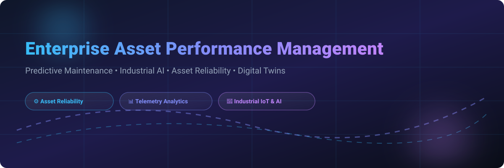

# Awesome Enterprise Asset Performance Management (APM) 🏭⚡

<p align="center">
  <a href="https://github.com/ishandutta2007/Awesome-Awesome-Awesome"></a><a href="https://discord.gg/jc4xtF58Ve"></a>
  <a href="https://github.com/ishandutta2007/Awesome-Enterprise-Asset-Performance-Management/stargazers"></a>
  <a href="https://github.com/ishandutta2007/Awesome-Enterprise-Asset-Performance-Management/network/members"></a>
  <a href="https://github.com/ishandutta2007/Awesome-Enterprise-Asset-Performance-Management/blob/main/LICENSE"></a>
  <a href="https://github.com/ishandutta2007"></a>
</p>



> **Curated List of SaaS Platforms & Open-Source GitHub Projects for Industrial Asset Performance Management (APM), Predictive Maintenance (PdM), Industrial AI, Asset Health Analytics, Condition Monitoring, Digital Twins & Reliability Engineering.**

---

## 📌 Table of Contents

- [📖 Overview & Market Analysis](#-overview--market-analysis)
- [🏢 Enterprise SaaS APM Platforms](#-enterprise-saas-apm-platforms)
- [🛠️ Open-Source GitHub Projects](#-open-source-github-projects)
- [🌐 Architecture Blueprint](#-architecture-blueprint)
- [🤝 How to Contribute](#-how-to-contribute)
- [📈 Star History](#-star-history)
- [💖 Support & Community](#-support--community)
- [⚖️ Disclaimer](#-disclaimer)

---

## 📖 Overview & Market Analysis

**Enterprise Asset Performance Management (APM)** combines operational data ingestion, machine health monitoring, predictive analytics, reliability engineering, and maintenance decision support to maximize industrial asset availability, reduce unplanned downtime, and optimize lifecycle costs.

### 📊 Estimated Market Size & Industry Dynamics

> 💡 **Market Size & Structure:** The global Enterprise Asset Performance Management (APM) market size was estimated at **~$2.5 Billion in 2024** and is projected to expand to **~$7.2 Billion by 2030** at a CAGR of **~15.4%**. The sector is **moderately fragmented**, contested by legacy industrial automation & ERP giants (Oracle, SAP, IBM, Siemens, AVEVA, GE Vernova) alongside fast-growing AI-native machine health platforms (Augury, Uptake, Cognite) and cloud-first digital CMMS suites (MaintainX, Fiix, Limble).

---

## 🏢 Enterprise SaaS APM Platforms

Below is a curated comparison of leading SaaS and enterprise APM platforms, sorted by **Company Size / Market Valuation (descending)**.

| Product Name 🚀 | Description 📝 | Company Size / Valuation 💰 | Pricing (Starting Tier) 💵 | Free Tier / Free Trial Limits 🎁 |
| :--- | :--- | :--- | :--- | :--- |
| **Oracle Asset Monitoring** | Industrial IoT & asset health analytics service within Oracle Cloud for tracking condition metrics and predicting equipment failures. | **$480.0 Billion** *(Market Cap)* | **$150 / user / month** | **30-day Free Trial** with $300 in cloud credits |
| **SAP Asset Performance Management** | Enterprise APM platform integrating asset reliability, risk strategies, and IoT operational data directly with SAP S/4HANA EAM. | **$260.0 Billion** *(Market Cap)* | **$2,500 / month** *(Base APM Cloud tier)* | **30-day SAP BTP Trial** *(1 sandbox tenant & asset dataset)* |
| **IBM Maximo APM / MAS** | Comprehensive asset-health monitoring, condition-based maintenance, AI failure prediction, and reliability engineering suite. | **$215.0 Billion** *(Market Cap)* | **$100 / user / month** *(MAS AppPoint bundle)* | **14-day Free Trial** *(5 AppPoint roles & pre-loaded demo environment)* |
| **Siemens Senseye** | AI-driven predictive maintenance and vibration analysis platform automating machine anomaly detection for manufacturing plants. | **$160.0 Billion** *(Market Cap)* | **$1,500 / month / plant** | **30-day Proof-of-Concept Trial** *(Up to 20 machine sensors)* |
| **AVEVA APM / Predictive Analytics** | Industrial AI software featuring predictive analytics, pattern recognition, digital twins, and asset risk matrix modeling. | **$120.0 Billion** *(Parent Valuation)* | **$1,800 / month** *(Site license)* | **30-day AVEVA Connect Trial** *(Up to 5 live telemetry asset streams)* |
| **GE Digital APM (GE Vernova)** | Enterprise asset reliability and strategy platform providing SmartSignal predictive analytics, RCA, and inspection management. | **$75.0 Billion** *(Market Cap)* | **$15,000 / year** *(Base plant site tier)* | **30-day Interactive Enterprise Demo** *(1 simulated plant dataset)* |
| **Hitachi Lumada APM** | Data-driven asset performance and operational intelligence suite leveraging IoT telemetry and AI analytics for utilities & transport. | **$70.0 Billion** *(Market Cap)* | **$20,000 / year** *(Enterprise package)* | **30-day Guided Sandbox Trial** *(Up to 5 equipment models)* |
| **Fiix (Rockwell Automation)** | Cloud-first CMMS and asset performance platform providing preventive maintenance workflows and IoT condition monitoring. | **$32.0 Billion** *(Market Cap)* | **$45 / user / month** *(Fiix Basic Plan)* | **Free-Forever Plan** *(Up to 3 users & 100 assets); 14-day Pro Trial* |
| **Hexagon APM (AssetWise)** | Engineering information, asset reliability, inspection management, and infrastructure lifecycle optimization software. | **$30.0 Billion** *(Market Cap)* | **$95 / user / month** | **14-day Hexagon Cloud Trial** *(Up to 3 named users)* |
| **eMaint (Fluke Reliability)** | Enterprise CMMS and condition monitoring system offering sensor integration, work management, and reliability analytics. | **$28.0 Billion** *(Parent Market Cap)* | **$69 / user / month** *(eMaint X4 Team Plan)* | **14-day Free Trial** *(Full access for 1 user, no credit card required)* |
| **AspenTech APM (Aspen Mtell)** | Machine learning-based predictive maintenance software that detects early pattern indicators of equipment degradation and failure. | **$15.0 Billion** *(Market Valuation)* | **$12,000 / year / plant** | **30-day Virtual Sandbox Trial** *(Up to 3 assets with failure signatures)* |
| **IFS APM (IFS Cloud)** | Asset performance capability embedded within IFS Cloud for condition tracking, maintenance strategy, and downtime reduction. | **$10.0 Billion** *(Valuation)* | **$120 / user / month** | **30-day IFS Cloud Interactive Demo** *(Pre-configured asset datasets)* |
| **Yokogawa OpreX Asset Health** | Industrial operational intelligence platform monitoring plant equipment health and orchestrating maintenance actions. | **$5.2 Billion** *(Market Cap)* | **$1,000 / month** *(Site subscription)* | **30-day OpreX Cloud Trial** *(Up to 10 live telemetry tags)* |
| **C3 AI Reliability** | Enterprise AI application using deep learning to predict equipment failures, optimize maintenance schedules, and monitor asset health. | **$3.2 Billion** *(Market Cap)* | **$10,000 / month** *(AWS/Azure Marketplace)* | **14-day Marketplace Free Trial** *(Up to 1,000 compute node-hours)* |
| **Cognite Data Fusion** | Industrial DataOps platform contextualizing OT, IT, and ET data into unified digital twin models for asset optimization. | **$1.6 Billion** *(Valuation)* | **$3,500 / month** *(Developer Workspace)* | **30-day Cognite Hub Trial** *(Ingest up to 10GB sensor telemetry)* |
| **Augury** | AI-driven machine health solution using continuous vibration/acoustic sensors and automated diagnostic insights. | **$1.2 Billion** *(Valuation)* | **$350 / machine / year** *(Hardware + AI service bundle)* | **60-day Risk-Free Pilot** *(Up to 10 assets with hardware sensors included)* |
| **MaintainX** | Mobile-first operations & CMMS software for work order management, preventive maintenance, procedures, and asset records. | **$1.0 Billion** *(Valuation)* | **$19 / user / month** *(Basic Paid Tier)* | **Free-Forever Plan** *(1 user, unlimited work orders); 14-day Premium Trial* |
| **Uptake** | Industrial AI asset performance software delivering predictive insights for heavy equipment, rail, aviation, and energy fleets. | **$1.0 Billion** *(Valuation)* | **$2,500 / month** *(Site plan)* | **14-day Guided Demo Trial** *(Access to sample industrial fleet logs)* |
| **Seeq** | Advanced analytics and time-series application for investigating plant operational data, anomaly detection, and predictive modeling. | **$600 Million** *(Valuation)* | **$750 / user / month** *(Seeq SaaS Team Tier)* | **30-day Seeq Cortex Cloud Trial** *(Up to 5 named analytics users)* |
| **Limble CMMS** | Cloud maintenance platform simplifying work requests, asset tracking, preventive maintenance schedules, and parts inventory. | **$450 Million** *(Valuation)* | **$28 / user / month** *(Starter Tier)* | **Free-Forever Plan** *(1 user, basic asset tracking); 7-day Business Trial* |
| **UpKeep** | Mobile EAM/CMMS solution empowering frontline technicians with asset management, IoT sensor integration, and maintenance workflows. | **$300 Million** *(Valuation)* | **$45 / user / month** *(Starter Plan)* | **Free-Forever Plan** *(1 user, up to 25 assets); 7-day Enterprise Trial* |
| **Samotics SAM4** | Electrical Signature Analysis (ESA) monitoring platform detecting mechanical and electrical faults in AC motors and pumps. | **$250 Million** *(Valuation)* | **$400 / asset / year** *(SAM4 Health ESA package)* | **90-day Pilot Program** *(Up to 5 motor-driven assets)* |
| **Nanoprecise** | AI-powered IoT platform using wireless tri-axial vibration & temperature sensors for continuous machine health prediction. | **$150 Million** *(Valuation)* | **$25 / sensor / month** *(RotationPulse sensor + Cloud)* | **30-day Trial Kit** *(Includes 4 free hardware sensors for validation)* |
| **TrendMiner** | Self-service time-series analytics software for process engineers to monitor, analyze, and predict industrial plant performance. | **$120 Million** *(Valuation)* | **$800 / user / month** | **14-day Self-Service Analytics Trial** *(Sample process telemetry)* |
| **Dingo** | Specialized asset reliability and condition management software (Trakka) for heavy equipment in mining and energy industries. | **$50 Million** *(Valuation)* | **$500 / month** *(Base site tier)* | **30-day Trakka Demo Trial** *(Up to 15 heavy equipment assets)* |

---

## 🛠️ Open-Source GitHub Projects

Building an open, self-hosted APM ecosystem requires combining open-source IoT data collection, time-series storage, stream processing, digital twin frameworks, machine learning models, and maintenance workflows.

Below are top open-source projects sorted by **GitHub Stars_Count (descending)**.

| Project & Repository 📦 | GitHub_Stars 🌟 | Description & APM Functionality ⚙️ |
| :--- | :---: | :--- |
| **TensorFlow**<br>`tensorflow/tensorflow` | [](https://github.com/tensorflow/tensorflow/stargazers) | Open-source machine learning framework for training predictive maintenance models, time-series forecasting, and anomaly detection. |
| **PyTorch**<br>`pytorch/pytorch` | [](https://github.com/pytorch/pytorch/stargazers) | Deep learning framework used for vibration signal analysis, sensor anomaly detection, and remaining useful life (RUL) predictions. |
| **Home Assistant**<br>`home-assistant/core` | [](https://github.com/home-assistant/core/stargazers) | Open-source telemetry and automation engine for light industrial or facility asset tracking and sensor monitoring. |
| **Grafana**<br>`grafana/grafana` | [](https://github.com/grafana/grafana/stargazers) | Operational visualization and dashboard platform for rendering real-time asset health KPIs, sensor charts, and maintenance alerts. |
| **scikit-learn**<br>`scikit-learn/scikit-learn` | [](https://github.com/scikit-learn/scikit-learn/stargazers) | Machine learning library for classical predictive maintenance, classification, regression, clustering, and failure prediction. |
| **Prometheus**<br>`prometheus/prometheus` | [](https://github.com/prometheus/prometheus/stargazers) | Time-series database and metric collection engine with alert rule processing for equipment metrics and IT/OT monitoring. |
| **Odoo Community**<br>`odoo/odoo` | [](https://github.com/odoo/odoo/stargazers) | Open-source ERP framework with built-in asset tracking, maintenance management, quality control, and IoT gateway connectivity. |
| **Apache Airflow**<br>`apache/airflow` | [](https://github.com/apache/airflow/stargazers) | Data pipeline orchestration platform for scheduling predictive maintenance model retraining, ETL jobs, and reliability reports. |
| **Apache Spark**<br>`apache/spark` | [](https://github.com/apache/spark/stargazers) | Unified analytics engine for large-scale historical equipment telemetry analysis and distributed machine learning. |
| **ERPNext**<br>`frappe/erpnext` | [](https://github.com/frappe/erpnext/stargazers) | Open-source enterprise ERP featuring modules for equipment maintenance, asset depreciation, work orders, and inventory tracking. |
| **Apache Kafka**<br>`apache/kafka` | [](https://github.com/apache/kafka/stargazers) | High-throughput distributed event-streaming platform transporting high-frequency sensor telemetry from edge nodes to analytics engines. |
| **InfluxDB**<br>`influxdata/influxdb` | [](https://github.com/influxdata/influxdb/stargazers) | Time-series database specifically optimized for storing high-frequency machine vibration, temperature, pressure, and energy telemetry. |
| **MLflow**<br>`mlflow/mlflow` | [](https://github.com/mlflow/mlflow/stargazers) | Open-source platform to manage the ML lifecycle, including experiment tracking, model registry, and deployment of predictive maintenance models. |
| **Apache Flink**<br>`apache/flink` | [](https://github.com/apache/flink/stargazers) | Real-time stream processing framework for complex event processing (CEP), instant anomaly detection, and sensor rule evaluation. |
| **TDengine**<br>`taosdata/TDengine` | [](https://github.com/taosdata/TDengine/stargazers) | High-performance open-source time-series database designed for Industrial IoT (IIoT), device telemetry, and edge analytics. |
| **Node-RED**<br>`node-red/node-red` | [](https://github.com/node-red/node-red/stargazers) | Low-code flow-based programming tool for connecting physical PLC sensors, industrial protocols, databases, and alerting webhooks. |
| **TimescaleDB**<br>`timescale/timescaledb` | [](https://github.com/timescale/timescaledb/stargazers) | Open-source relational time-series database built on PostgreSQL, ideal for combining relational asset metadata with telemetry metrics. |
| **ThingsBoard**<br>`thingsboard/thingsboard` | [](https://github.com/thingsboard/thingsboard/stargazers) | Feature-rich open-source IoT platform for device and asset management, telemetry collection, rule engine, and asset dashboards. |
| **QuestDB**<br>`questdb/questdb` | [](https://github.com/questdb/questdb/stargazers) | Ultra-fast open-source SQL time-series database optimized for real-time sensor metrics and high-ingestion industrial applications. |
| **EMQX**<br>`emqx/emqx` | [](https://github.com/emqx/emqx/stargazers) | Cloud-native open-source MQTT broker connecting millions of industrial IoT devices and telemetry data streams. |
| **OpenProject**<br>`opf/openproject` | [](https://github.com/opf/openproject/stargazers) | Open-source project management platform used for managing plant overhaul projects, maintenance programs, and reliability initiatives. |
| **Kubeflow**<br>`kubeflow/kubeflow` | [](https://github.com/kubeflow/kubeflow/stargazers) | Cloud-native machine learning toolkit for Kubernetes, orchestrating end-to-end predictive maintenance pipelines at enterprise scale. |
| **OpenSearch**<br>`opensearch-project/OpenSearch` | [](https://github.com/opensearch-project/OpenSearch/stargazers) | Distributed search and analytics engine for indexing industrial alarm logs, maintenance work order texts, and failure records. |
| **PyOD**<br>`yzhao062/pyod` | [](https://github.com/yzhao062/pyod/stargazers) | Comprehensive Python toolkit for detecting anomalies and outliers in multivariate sensor and operational telemetry. |
| **PyCaret**<br>`pycaret/pycaret` | [](https://github.com/pycaret/pycaret/stargazers) | Open-source low-code machine learning library for rapidly prototyping asset health classification and failure prediction models. |
| **Darts**<br>`unit8co/darts` | [](https://github.com/unit8co/darts/stargazers) | Python library for user-friendly forecasting and time-series forecasting applied to equipment health and load degradation. |
| **OpenTelemetry Collector**<br>`open-telemetry/opentelemetry-collector` | [](https://github.com/open-telemetry/opentelemetry-collector/stargazers) | Vendor-agnostic proxy for receiving, processing, and exporting operational metrics, telemetry, and system traces. |
| **Kats**<br>`facebookresearch/Kats` | [](https://github.com/facebookresearch/Kats/stargazers) | Time-series intelligence library by Meta for forecasting, outlier detection, and pattern recognition in time-series telemetry. |
| **Apache IoTDB**<br>`apache/iotdb` | [](https://github.com/apache/iotdb/stargazers) | High-performance industrial time-series database natively designed for edge-cloud deployments and complex equipment hierarchies. |
| **Apache NiFi**<br>`apache/nifi` | [](https://github.com/apache/nifi/stargazers) | Automated dataflow software for ingesting, transforming, routing, and synchronizing operational data across plant boundaries. |
| **River**<br>`online-ml/river` | [](https://github.com/online-ml/river/stargazers) | Online streaming machine learning library in Python for continuously adapting predictive models from live sensor data. |
| **Nixtla StatsForecast**<br>`Nixtla/statsforecast` | [](https://github.com/Nixtla/statsforecast/stargazers) | Lightning-fast statistical time-series forecasting models for equipment telemetry and spare parts maintenance demand forecasting. |
| **Merlion**<br>`salesforce/Merlion` | [](https://github.com/salesforce/Merlion/stargazers) | Python framework for time-series intelligence, providing anomaly detection and forecasting for machine telemetry streams. |
| **Open62541**<br>`open62541/open62541` | [](https://github.com/open62541/open62541/stargazers) | Open-source C implementation of OPC UA (IEC 62541) protocol for standardized industrial data collection from PLCs. |
| **ThingsBoard Gateway**<br>`thingsboard/thingsboard-gateway` | [](https://github.com/thingsboard/thingsboard-gateway/stargazers) | Open-source IoT gateway connecting Modbus, CAN, BACnet, BLE, OPC-UA, MQTT, and REST protocols to central APM systems. |
| **OpenRemote**<br>`openremote/openremote` | [](https://github.com/openremote/openremote/stargazers) | Open-source IoT asset management platform with asset modeling, flow processing, dashboards, and automated maintenance rules. |
| **OpenEMS**<br>`openems/openems` | [](https://github.com/openems/openems/stargazers) | Open-source energy management system for controlling and optimizing energy storage, PV, and industrial power assets. |
| **EdgeX Foundry**<br>`edgexfoundry/edgex-go` | [](https://github.com/edgexfoundry/edgex-go/stargazers) | Vendor-neutral open-source edge IoT framework facilitating interoperability between industrial sensors and cloud APM software. |
| **Eclipse Milo**<br>`eclipse-milo/milo` | [](https://github.com/eclipse-milo/milo/stargazers) | Production-ready Java implementation of OPC UA client/server specification for industrial control system integration. |
| **OpenHAB Core**<br>`openhab/openhab-core` | [](https://github.com/openhab/openhab-core/stargazers) | Core integration runtime for connecting heterogeneous devices, sensors, and automation components in facility APM setups. |
| **Eclipse Ditto**<br>`eclipse-ditto/ditto` | [](https://github.com/eclipse-ditto/ditto/stargazers) | Open-source digital twin framework providing state synchronization and digital asset representation for physical hardware. |
| **Eclipse Kura**<br>`eclipse/kura` | [](https://github.com/eclipse/kura/stargazers) | Java/OSGi edge framework for managing industrial gateways, fieldbus communications, and edge telemetry processing. |
| **FIWARE Orion Context Broker**<br>`telefonicaid/fiware-orion` | [](https://github.com/telefonicaid/fiware-orion/stargazers) | Open-source NGSI context broker managing real-time state information for smart industrial assets and sensor arrays. |
| **Eclipse Kapua**<br>`eclipse-kapua/kapua` | [](https://github.com/eclipse-kapua/kapua/stargazers) | Open-source IoT cloud platform for device management, data management, and integration with enterprise asset systems. |

---

## 🌐 Architecture Blueprint

To build a **complete self-hosted Enterprise APM platform**, industrial engineers can combine open-source layers into a unified stack:

```
┌─────────────────────────────────────────────────────────────────────────┐
│                      OPERATIONAL VISUALIZATION & EAM                    │
│    Grafana Dashboards  •  Odoo / ERPNext / OpenProject (Work Orders)    │
└────────────────────────────────────▲────────────────────────────────────┘
                                     │
┌────────────────────────────────────┴────────────────────────────────────┐
│                  PREDICTIVE ANALYTICS & DIGITAL TWINS                   │
│   PyTorch / TensorFlow (RUL) • PyOD (Anomalies) • Eclipse Ditto (Twin)  │
└────────────────────────────────────▲────────────────────────────────────┘
                                     │
┌────────────────────────────────────┴────────────────────────────────────┐
│                    TIME-SERIES STORAGE & STREAMING                      │
│   Apache IoTDB / InfluxDB / TDengine  •  Apache Kafka & Apache Flink    │
└────────────────────────────────────▲────────────────────────────────────┘
                                     │
┌────────────────────────────────────┴────────────────────────────────────┐
│                  INDUSTRIAL DATA INGESTION & PROTOCOLS                  │
│    Open62541 / Eclipse Milo (OPC UA)  •  ThingsBoard Gateway  •  EMQX   │
└─────────────────────────────────────────────────────────────────────────┘
```

---

## 🤝 How to Contribute

Contributions are warmly welcomed! Help expand and maintain this Enterprise APM reference guide:

1. **Fork** the repository: `https://github.com/ishandutta2007/Awesome-Enterprise-Asset-Performance-Management`
2. **Add/Edit** entries in `README.md` following the exact table structure.
3. Ensure entries include accurate pricing details, free trial limits, company valuations, and official project links.
4. **Submit a Pull Request** with a brief explanation of your additions.

Read our complete list of awesome projects at [Awesome-Awesome-Awesome](https://github.com/ishandutta2007/Awesome-Awesome-Awesome).

---

## 📈 Star History

[](https://star-history.dera.page/#ishandutta2007/Awesome-Enterprise-Asset-Performance-Management&type=date&legend=top-left)

---

## 💖 Support & Community

If you find this curated Enterprise Asset Performance Management ecosystem list helpful, please consider supporting the project:

* 🌟 **Star this repository** on GitHub to help others discover it.
* 🔀 **Fork and contribute** by submitting Pull Requests with new tools, datasets, or platforms.
* 📢 **Share with your network** on LinkedIn, Twitter/X, and industrial engineering forums.
* ☕ **Sponsor the Maintainer**: Support ongoing updates via [GitHub Sponsors](https://github.com/sponsors/ishandutta2007).

---

## ⚖️ Disclaimer

* This repository is a community-curated directory intended for educational and reference purposes.
* All company names, software names, and logos are trademarks of their respective owners.
* Product pricing, free trial availability, and features are subject to vendor updates.
* Open-source software does not automatically grant industrial safety or regulatory compliance without rigorous operational testing.

---

<p align="center">
  <sub>Made with ❤️ for Reliability Engineers, Maintenance Managers, Plant Operators, Data Scientists & Industrial AI Developers worldwide.</sub>
</p>
